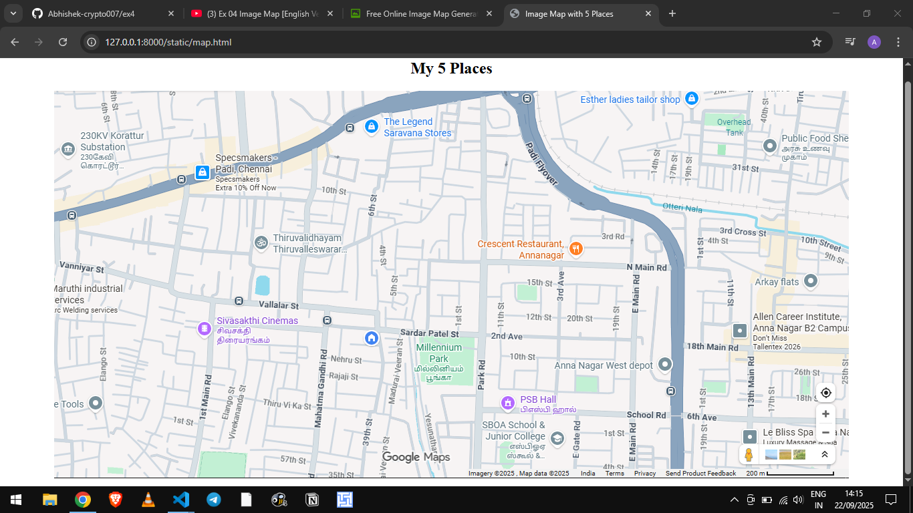
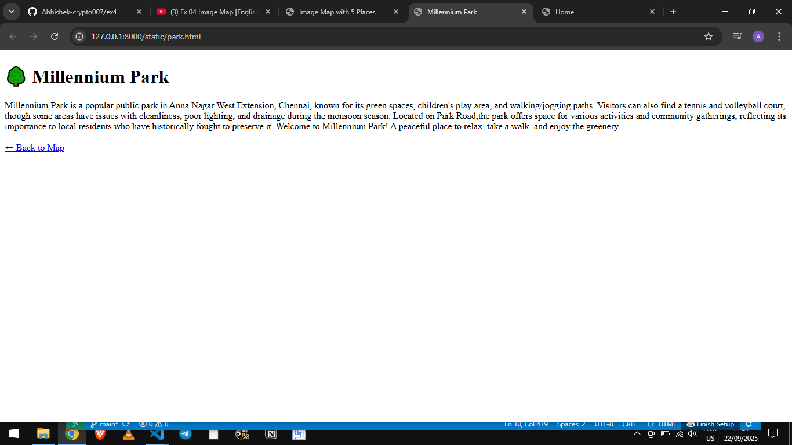
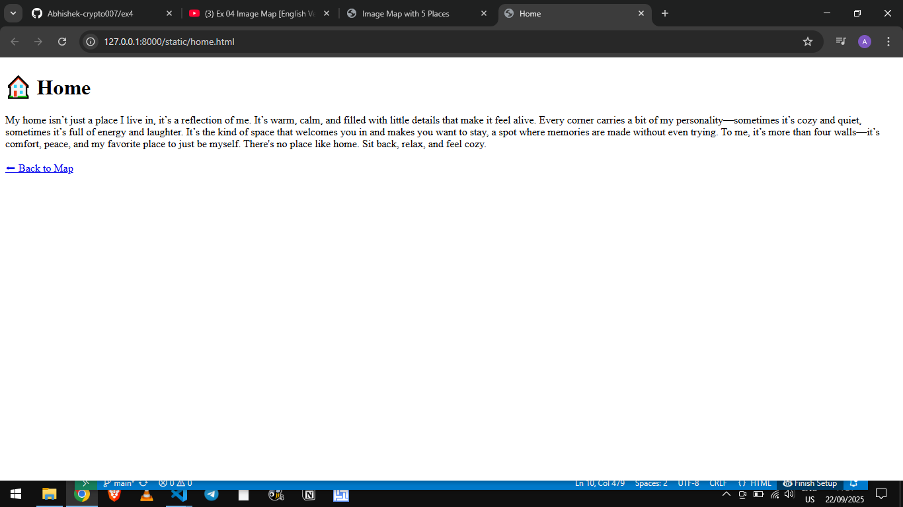
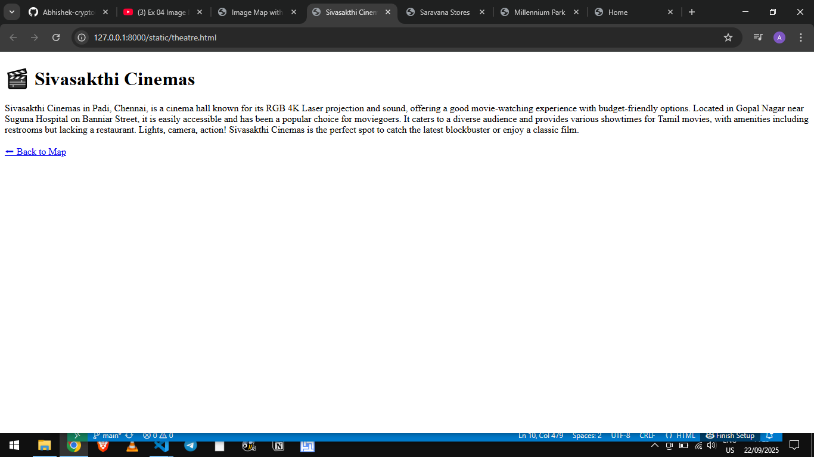
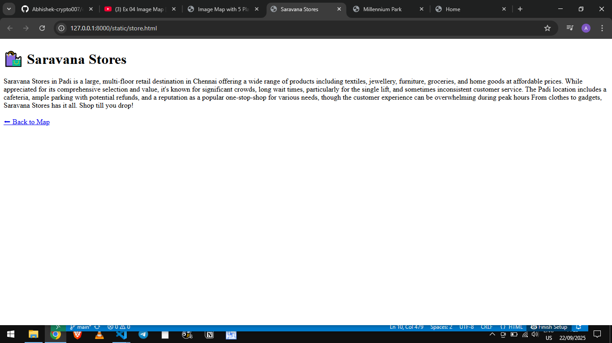

# Ex04 Places Around Me
## Date: 22.09.2025

## AIM
To develop a website to display details about the places around my house.

## DESIGN STEPS

### STEP 1
Create a Django admin interface.

### STEP 2
Download your city map from Google.

### STEP 3
Using ```<map>``` tag name the map.

### STEP 4
Create clickable regions in the image using ```<area>``` tag.

### STEP 5
Write HTML programs for all the regions identified.

### STEP 6
Execute the programs and publish them.

## CODE
```
map.html

<!DOCTYPE html>
<html lang="en">
<head>
  <meta charset="UTF-8">
  <title>Image Map with 5 Places</title>
</head>
<body>
  <center>
    <h2>My 5 Places</h2>
  </center>
<center>
   

</center>

    <map name="image-map">
    <area target="_blank" alt="Millennium Park" title="Millennium Park" href="park.html" coords="539,372,632,436" shape="rect">
    <area target="_blank" alt="Sivasakthi Cinemas" title="Sivasakthi Cinemas" href="theatre.html" coords="212,333,369,379" shape="rect">
    <area target="_blank" alt="Saravana Stores" title="Saravana Stores" href="store.html" coords="463,36,602,78" shape="rect">
    <area target="_blank" alt="Home" title="Home" href="home.html" coords="474,369,27" shape="circle">
</map>
</body>
</html>


store.html

<!DOCTYPE html>
<html lang="en">
<head>
  <meta charset="UTF-8">
  <title>Saravana Stores</title>
</head>
<body>
  <h1>🛍️ Saravana Stores</h1>
  <p>
    Saravana Stores in Padi is a large, multi-floor retail destination in Chennai offering a wide range of products including textiles, jewellery, furniture, groceries, and home goods at affordable prices. 
    While appreciated for its comprehensive selection and value, it's known for significant crowds, long wait times, particularly for the single lift, and sometimes inconsistent customer service.
     The Padi location includes a cafeteria, ample parking with potential refunds, and a reputation as a popular one-stop-shop for various needs, though the customer experience can be overwhelming during peak hours
    From clothes to gadgets, Saravana Stores has it all. Shop till you drop!</p>
  <p><a href="index.html">⬅ Back to Map</a></p>
</body>
</html>


theatre.html

<!DOCTYPE html>
<html lang="en">
<head>
  <meta charset="UTF-8">
  <title>Sivasakthi Cinemas</title>
</head>
<body>
  <h1>🎬 Sivasakthi Cinemas</h1>
  <p>
    Sivasakthi Cinemas in Padi, Chennai, is a cinema hall known for its RGB 4K Laser projection and sound, offering a good movie-watching experience with budget-friendly options.
     Located in Gopal Nagar near Suguna Hospital on Banniar Street, it is easily accessible and has been a popular choice for moviegoers. 
    It caters to a diverse audience and provides various showtimes for Tamil movies, with amenities including restrooms but lacking a restaurant.  
   
    Lights, camera, action! Sivasakthi Cinemas is the perfect spot to catch the latest blockbuster or enjoy a classic film.</p>
  <p><a href="index.html">⬅ Back to Map</a></p>
</body>
</html>


home.html

<!DOCTYPE html>
<html lang="en">
<head>
  <meta charset="UTF-8">
  <title>Home</title>
</head>
<body>
  <h1>🏠 Home</h1>
  <p>
    My home isn’t just a place I live in, it’s a reflection of me. It’s warm, calm, and filled with little details that make it feel alive. Every corner carries a bit of my personality—sometimes it’s cozy and quiet, sometimes it’s full of energy and laughter. It’s the kind of space that welcomes you in and makes you want to stay, a spot where memories are made without even trying. To me, it’s more than four walls—it’s comfort, peace, and my favorite place to just be myself.
    
    
    
    
    
    There's no place like home. Sit back, relax, and feel cozy.</p>
  <p><a href="index.html">⬅ Back to Map</a></p>
</body>
</html>


park.html

<!DOCTYPE html>
<html lang="en">
<head>
  <meta charset="UTF-8">
  <title>Millennium Park</title>
</head>
<body>
  <h1>🌳 Millennium Park</h1>
  <p>
    Millennium Park is a popular public park in Anna Nagar West Extension, Chennai, known for its green spaces, children's play area, and walking/jogging paths.
    Visitors can also find a tennis and volleyball court, though some areas have issues with cleanliness, poor lighting, and drainage during the monsoon season.
    Located on Park Road,the park offers space for various activities and community gatherings, reflecting its importance to local residents who have historically
    fought to preserve it.  

    Welcome to Millennium Park! A peaceful place to relax, take a walk, and enjoy the greenery.</p>
  <p><a href="index.html">⬅ Back to Map</a></p>
</body>
</html>


```

## OUTPUT







## RESULT
The program for implementing image maps using HTML is executed successfully.
